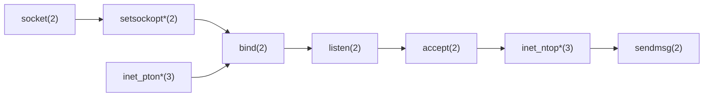
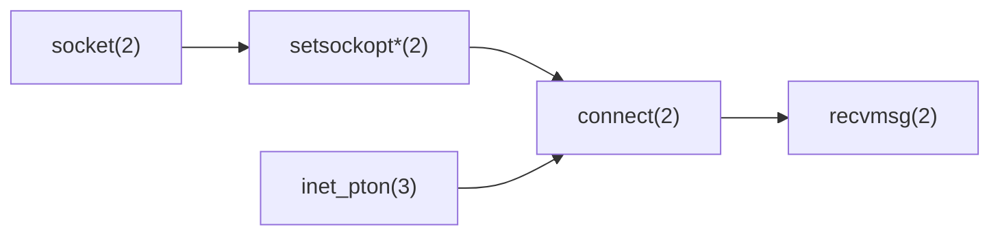

本文以基礎的傳送端和接收端所需寫的 TCP 程式下筆，未來有需要再撰寫較為深入的內容。

## 待傳輸資料結構

嘗試用兩種資料結構進行實驗，固定長度的和不固定長度的資料，其中不定長度的資料通常會在資料內部（或者其上層 Header）包含資料的長度資訊。假設我們要傳一系列 2D 點的座標 `(x, y)` 的資料，資料結構如下

```C++
struct Point {
  float x, y;
} __attribute__((packed));
```

- 固定長度：每次封包固定傳 5 個點
- 不固定長度：資料本身包含點數

本範例先以固定長度進行練習，另外必須加上 `__attribute__((packed))` 防止編譯器自動對齊

## 傳送端（伺服器端）

等到與用戶端連線後才開始傳輸資料，否則伺服器不知道要往那傳資料，常見的函數呼叫流程如下



\* 可選選項

```C++
#include <arpa/inet.h>
#include <unistd.h>  // close

#include <cstring>  // memset
#include <iostream>
#include <vector>

struct Point {
  float x, y;
} __attribute__((packed));

int main() {
  int sock_s;
  if ((sock_s = socket(AF_INET, SOCK_STREAM, 0)) == -1) {
    std::cerr << "socket(2) failed!\n";
    return 1;
  }

  int opt = 1;
  if (setsockopt(sock_s, SOL_SOCKET, SO_REUSEADDR, &opt, sizeof(opt)) == -1) {
    std::cerr << "setsockopt(2) failed!\n";
    close(sock_s);
    return 1;
  }

  struct sockaddr_in addr_s;
  addr_s.sin_family = AF_INET;
  addr_s.sin_port = htons(2368);
  char ip[] = "192.168.1.10";
  if (inet_pton(AF_INET, ip, &addr_s.sin_addr) <= 0) {
    std::cerr << "inet_pton(3) failed!\n";
    return 1;
  }
  // addr_s.sin_addr.s_addr = INADDR_ANY;

  if (bind(sock_s, (struct sockaddr *)&addr_s, sizeof(addr_s)) == -1) {
    std::cerr << "bind(2) failed\n";
    close(sock_s);
    return 1;
  }

  if (listen(sock_s, 5) < 0) {
    std::cerr << "listen(2) failed\n";
    close(sock_s);
    return 1;
  }

  std::cout << "Waiting for connection on port 2368..." << std::endl;

  int sock_c;
  struct sockaddr_in addr_c;
  socklen_t len_addr_c = sizeof(addr_c);
  if ((sock_c = accept(sock_s, (struct sockaddr *)&addr_c, &len_addr_c)) < 0) {
    std::cerr << "accept(2) failed\n";
    close(sock_s);
    return 1;
  }

  char ipstr[INET_ADDRSTRLEN];
  inet_ntop(AF_INET, &addr_c.sin_addr, ipstr, sizeof(ipstr));
  if (std::string(ipstr) != "192.168.1.100") {
    std::cerr << "Connection from invalid IP: " << ipstr << std::endl;
    close(sock_c);
    close(sock_s);
    return 1;
  }
  std::cout << "Client connected!\n";
  std::cout << "  Family: " << addr_c.sin_family << std::endl;
  std::cout << "  IP: " << ipstr << std::endl;
  std::cout << "  Port: " << ntohs(addr_c.sin_port) << std::endl;

  constexpr const int kNumPoints = 5;
  std::vector<Point> points(kNumPoints);
  struct iovec iov[kNumPoints];
  for (int i = 0; i < kNumPoints; ++i) {
    points[i].x = i / 2. + 0.1;
    points[i].y = i + 0.1;
    iov[i].iov_base = &points[i];
    iov[i].iov_len = sizeof(Point);
  }

  struct msghdr msg;
  memset(&msg, 0, sizeof(msg));
  msg.msg_iov = iov;
  msg.msg_iovlen = kNumPoints;

  if (size_t bytes = sendmsg(sock_c, &msg, 0); bytes <= 0) {
    std::cerr << "sendmsg(2) failed\n";
    close(sock_c);
    close(sock_s);
    return 1;
  } else {
    std::cout << "Sent " << bytes << " bytes\n";
    for (int i = 0; i < kNumPoints; ++i)
      std::cout << "[" << i << "] x: " << points[i].x << ", y: " << points[i].y
                << "\n";
  }

  close(sock_c);
  close(sock_s);
}
```

說明：

- `int socket(int domain, int type, int protocol);`
  - `domeain`: `IF_INET` 和 `PF_INET` 都指 IPv4，其中前者較長使用
  - `type`: `SOCK_STREAM` 為 TCP 協議，`SOCK_DGRAM` 為 UDP 協議
  - `protocol`: 一般設為 `0`，系統會跟前面參數選擇適當的協議
  - 回傳文件描述符，`-1` 表示失敗
- `struct sockaddr_in` 結構儲存 IPv4 地址和連結端口

  - `INADDR_ANY` 表示在所有已連接網路界面上監聽端口
    ```
    指令 ss -ta 會看到 0.0.0.0:2368，具體來說，假設
    乙太網路給機器分配了 IP A，而 Wifi 給機器分配了 IP B
    當伺服器在 0.0.0.0:2368 上啟動時，
    如果有客戶端試圖連接 A:2368，或 B:2368，伺服器都會接收並處理這個連接。
    ```
  - `htons()` 是將 host 的端口值轉成 network 的端口值，通常是小端轉大端

    - 端口的大小是 0~65535，因此型別為 `unsigned short` (`uint16_t`)

    ```C++
    uint16_t port = 2306;
        cout << format("Host Port: 0x{:04X}\n", port);  // 0x0902
        cout << format("Network Port: 0x{:04X}\n", htons(port));  // 0x0209
    ```

- `int setsockopt(int sockfd, int level, int optname, const void optval[.optlen], socklen_t optlen);`

  - `level`: `SOL_SOCKET` 表示此選項屬於 socket 層
  - `optname`: `SO_REUSEADDR` 決定關閉後是否可以重複使用地址而沒有 `TIME_WAIT` 狀態，如何確定端口是否處於 `TIME_WAIT` 狀態，可以利用指令 `ss -tua`，參考 `socket(7)` 說明

    ```txt
    SO_REUSEADDR
        Indicates that the rules used in validating addresses supplied in a bind(2) call should allow reuse of local addresses. For AF_INET sockets this means that a socket may bind, except when there is an active listening socket bound to the address. When the listening socket is bound to INADDR_ANY with a specific port then it is not possible to bind to this port for any local address. Argument is an integer boolean flag.
    ```

  - `optval`: 選項的指標，型態一般為 `int *`
  - `optlen`: `optval` 的大小
  - 正常回傳 `0`，錯誤回傳 `-1`

- `int bind(int sockfd, const struct sockaddr *addr, socklen_t addrlen);`
  - 將地址與 socket 文件描述符綁定，正常回傳 `0`，錯誤回傳 `-1`
  - 注意此函數是 POSIX 的 `bind(2)`，與 C++ 的 `bind` 函數不同
- `int listen(int sockfd, int backlog);`
  - `backlog` 為最大佇列，即最大允許用戶端同時連結的數量。佇列滿時，新的用戶端連線時會收到 `ECONNREFUSED`
  - 正常回傳 `0`，錯誤回傳 `-1`
- `int accept(int sockfd, struct sockaddr *_Nullable restrict addr, socklen_t *_Nullable restrict addrlen);`
  - `addr` 為型態為通用的 `sockaddr`，建議從 `sockaddr_in` 進行型別轉換
- `int inet_pton(int af, const char *restrict src, void *restrict dst);`
  - 此處用於設定伺服器端的 IP 位置
  - `inet_pton(3)` 為新的庫函數，為了取代掉能力有限的 `inet_aton(2)`
  - 此庫函數的回傳值，正常回傳 `1`，`src` 錯誤回傳 `0`，`af` 錯誤回傳 `-1`\
  - 若想讓系統監聽所有可用 IP 的特定端口值，可以利用 `INADDR_ANY`
- `const char *inet_ntop(int af, const void *restrict src, char dst[restrict .size], socklen_t size);`
  - 此處用於確認連線用戶端的 IP 位置
  - `inet_ntop(3)` 為新的庫函數，為了取代掉能力有限的 `inet_ntoa(2)`
  - 可以搭配 `char ipstr[INET_ADDRSTRLEN];` 使用
  - 此庫函數的回傳值，正常為 non-null 的 `dst` 指標，錯誤則回傳 `NULL`
- `ssize_t sendmsg(int sockfd, const struct msghdr *msg, int flags);`
  - 新的通用的傳輸函式，使用方式參考程式或 man page，其中 `struct msghdr` 定義如下
    ```
    struct msghdr {
    	void         *msg_name;       /* Optional address */
    	socklen_t     msg_namelen;    /* Size of address */
    	struct iovec *msg_iov;        /* Scatter/gather array */
    	size_t        msg_iovlen;     /* # elements in msg_iov */
    	void         *msg_control;    /* Ancillary data, see below */
    	size_t        msg_controllen; /* Ancillary data buffer len */
    	int           msg_flags;      /* Flags (unused) */
    };
    ```
  - 在傳輸多段資料時比使用多次 `send(2)` 效率更高
  - 也適合進行非同步 IO 和 零拷貝傳輸的場景

## 接收端（用戶端）

用戶端嘗試與伺服器端連線，指定好伺服器端 IP 後，用戶端會選擇適合的網卡與 IP，這邊的 IP 會是 `ip addr show` 所能看到的 IP，常見的函數呼叫流程如下



\* 可選選項

```C++
#include <arpa/inet.h>
#include <unistd.h>

#include <cstring>
#include <iostream>
#include <vector>

struct Point {
  float x, y;
} __attribute__((packed));

int main() {
  int sock = 0;
  if ((sock = socket(AF_INET, SOCK_STREAM, 0)) == -1) {
    std::cerr << "socket(2) failed!\n";
    return 1;
  }

  struct sockaddr_in addr;
  addr.sin_family = AF_INET;
  addr.sin_port = htons(2368);
  char ip[] = "192.168.1.10";
  if (inet_pton(AF_INET, ip, &addr.sin_addr) <= 0) {
    std::cerr << "inet_pton(3) failed!\n";
    return 1;
  }

  if (connect(sock, (struct sockaddr *)&addr, sizeof(addr)) == -1) {
    std::cerr << "connect(2) failed!\n";
    return 1;
  }

  std::cout << "Server connected!\n";
  std::cout << "  Family: " << addr.sin_family << std::endl;
  std::cout << "  IP: " << ip << std::endl;
  std::cout << "  Port: " << ntohs(addr.sin_port) << std::endl;

  constexpr const int kNumPoints = 5;
  std::vector<Point> points(kNumPoints);
  struct iovec iov[kNumPoints];
  for (int i = 0; i < kNumPoints; ++i) {
    iov[i].iov_base = &points[i];
    iov[i].iov_len = sizeof(Point);
  }

  struct msghdr msg;
  memset(&msg, 0, sizeof(msg));
  msg.msg_iov = iov;
  msg.msg_iovlen = kNumPoints;

  if (size_t bytes = recvmsg(sock, &msg, 0); bytes <= 0) {
    std::cerr << "recvmsg(2) failed\n";
    close(sock);
    return 1;
  } else {
    std::cout << "Received " << bytes << " bytes\n";
    for (int i = 0; i < kNumPoints; ++i)
      std::cout << "[" << i << "] x: " << points[i].x << ", y: " << points[i].y
                << "\n";
  }

  close(sock);
}
```

- `ssize_t recvmsg(int sockfd, struct msghdr *msg, int flags);`
  - `recvmsg` 是 `sendmsg` 的對應版本，使用方式參考程式

## 模擬實際傳輸 IP 環境

上面的程式沒有特別對 IP 進行限制，先指定伺服器端與用戶端的實際 IP 位置分別為 `192.168.0.10:2368` 和 `192.168.0.100`，伺服器端限制只接受來自 `192.168.0.100` 的連線

首先在 loopback 接口上增加網路

```bash
sudo ip addr add 192.168.1.100/24 dev lo  # valid client
# server and client work

sudo ip addr del 192.168.1.100/24 dev lo
sudo ip addr add 192.168.1.200/24 dev lo  # invalid client
# client will be reject by server
```

- 客戶端基本上不會特別綁定 IP 地址，系統會自動選擇一個適當的 IP 地址（透過 `connect(2)`）與隨機端口
- 如果客戶端和伺服器在同一台機器上，客戶端通常會默認使用 `127.0.0.1`

## 結語

本文以傳送端和接收端的基礎程式為出發點，介紹了網絡程式設計中的常見 API 調用流程和相關細節，也撰寫了流程圖提供高層次的程式理解，程式本體相當簡單但卻有很多可以深入探討的地方。未來我們可以探討更複雜的網絡程式，如多執行緒伺服器、非同步 IO 模型、甚至引入加密技術來提高通訊的安全性，令一個方向是透過 `tcpdump` 和 `wireshark` 等工具實際查看封包到底送了哪些資料，增進理解。
